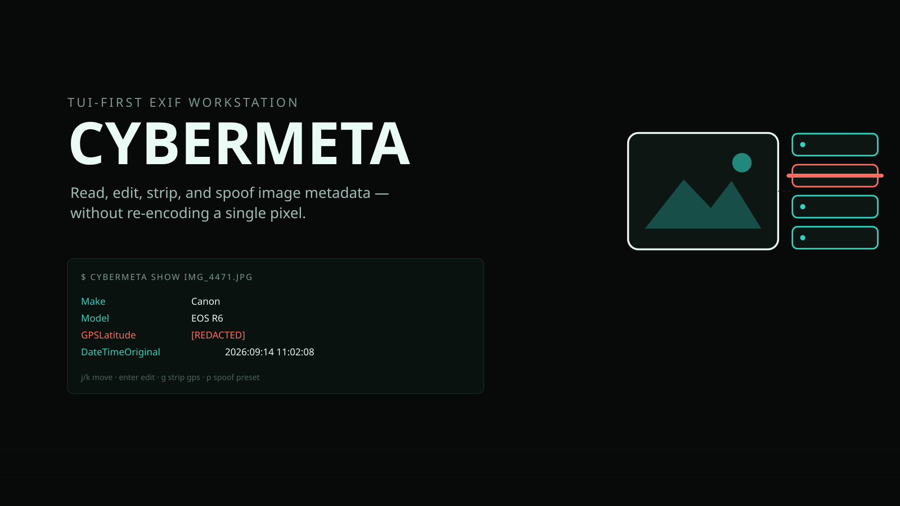

<p align="center">
  
</p>

<p align="center">
  <a href="https://cybercore-tech.github.io/cybermeta/">Site →</a>
</p>

[](https://github.com/cybercore-tech/cybermeta/actions/workflows/ci.yml)
[](https://github.com/cybercore-tech/cybermeta/actions/workflows/release.yml)

# cybermeta

TUI-first EXIF workstation for the **Cybercore Systems Framework**.

Read, edit, strip, and spoof image metadata without re-encoding pixels. Interactive UI uses the embedded CYBERGRID palette from [`cybercore`](https://github.com/cybercore-tech/cybercore) (`~/.sysops/cybercore`). CLI subcommands stay machine-parsable for scripts and pipes.

## Install

```bash
curl -fsSL https://raw.githubusercontent.com/cybercore-tech/cybermeta/main/install.sh | sh
```

Downloads the latest release for your platform (Linux or macOS, x86_64
or aarch64), verifies its SHA-256 checksum, and installs `cybermeta`
to `~/.local/bin`. Or build from source with `cargo build --release`.

## Usage

```text
cybermeta                      # TUI (path prompt)
cybermeta <file>               # TUI on file
cybermeta show <file> [--format json|tsv]
cybermeta export <file> [-f json|tsv]
cybermeta strip <file> --gps|--all [-o out] [--in-place]
cybermeta set <file> TAG=VALUE [-o out] [--in-place]
cybermeta spoof <file> --preset <name> [-o out] [--in-place]
cybermeta spoof --list
```

Writes default to `<stem>.cybermeta.<ext>` next to the source. Pass `--in-place` only when you intend to overwrite.

### Editable string tags (`set` / TUI Enter)

`Make`, `Model`, `Software`, `Artist`, `Copyright`, `ImageDescription`, `ModifyDate` / `DateTime`, `DateTimeOriginal`, `CreateDate`, `LensMake`, `LensModel`, GPS latitude/longitude refs.

### Presets

| Preset | Effect |
|---|---|
| `strip-gps` | Remove GPS IFD / geolocation tags |
| `anonymous-camera` | Strip device identity; set generic Make/Model/Software |
| `clear-all` | Keep structural TIFF tags only |

## TUI keys

| Key | Action |
|---|---|
| `j` / `k` | Move |
| `/` | Filter |
| `Enter` | Edit selected string tag |
| `g` | Strip GPS |
| `X` | Strip all (confirm) |
| `p` | Spoof / scrub presets |
| `s` | Save to `*.cybermeta.*` |
| `S` | Save in-place |
| `e` | Export JSON sidecar |
| `o` | Open another path |
| `q` | Quit |

Theme follows `CYBERGRID_THEME` / cybercore’s active theme.

## Formats

JPEG / TIFF first-class. PNG, WebP, JXL, HEIF/AVIF where `little_exif` can write metadata without touching pixels.

## License

MIT — Copyright (c) 2026 Cybercore Tech (subgridsec.org)

Independent open-source utility under the Cyber prefix; no affiliation with any external cybersecurity vendor or agency.

Contact: cybercore.sh+cybermeta@gmail.com · [subgridsec.org](https://subgridsec.org)
